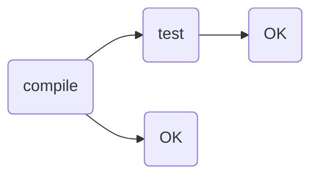

# Heros (crud of SuperHeros)
## Introduccion
Este proyecto es un **ABMC**(Alta Baja Modificacion y Consulta), tambien conocido como **CRUD**(Create Read Update Delete) de heros.
Donde un hero tiene un **nombre**, un **ID**, **descripcion**
## Issues
1. read all heros
2. read hero by **ID**
3. read heros by **name**
	- busqueda por **LIKE**
	- no diferenciar *mayuscula* de *minuscula*
4. update de un hero por **ID**
	- update *name*, *fuerza*
	- retornar codido de error si no se encuentra hero con ese *ID*
5. delete de un hero
6. *Unit test* de *Service* y *E2E*

## Pasos iniciales

1. crear repo en **github**
2. usar **spring-boot** para crear esqueleto del proyecto (ver directorio **/batch**)
3. crear directorio **/webhook** para el manejo de las *actions* de **github**

## Login
1. datos de acceso
	1. user=admin
	2. password=admin
	
## TIPs del proyecto

1. Uso de **.gitignore** para no subir **\target** entre otros o ejecutar **mvn clean** antes de subir
2. Uso **`DockerFile`**
	1. para el **`DockerFile`** usar algo de la forma
		```
		FROM imagen-conjkd11 
		WORKDIR
		RUN
		USER
		VOLUME /directorio
		EXPOSE puerto
		ENTRYPOINT comando
		```
3. Crear imagen de docker con plugin de **maven** (*dockerfile-maven-plugin*)
	1.comando util **`mvn clean package dockerfile:build`**
4. Documentar con swagger => se detalla la funcionalidad en cada metodo
	1. usar **springfox** para swagger
		1.el **swagger** se puede usar por configuracion o por scan del codigo
	2. url de swagger http://localhost:9080/swagger-ui.html
5. Crear un annotation propio 
	1. Se maneja un log para registrar el tiempo , se debe usar un **Aspecto** para manejarlo
6. Siempre es recomendable el uso **@lombok** para mayor claridad
7. Se listan comandos utiles para ejecutar
	1. **`mvn spring-boot:run`** 
	2. **`mvn clean install`**
	3. **`docker run [image] -p port_x:port_y...`**
	4. **`docker stop ...`**
	5. **`mvn flyway:migrate`** (para ejecutar **flyway** de forma manual)
8. Armar los **SQL** de datos (DDL), que seran usados por **FLYWAY**
9. Se usa **mapstruct** para mapear POJOs ( ir a https://mapstruct.org/documentation/ide-support/ para integrar con eclipse)
10. Se resuelve con una **arquitectura de N capas** ((N-layer architecture).<br>Recomendable, la nomenclatura en **SINGULAR**
- /aspect
- /configuration 
- /controller
- /exception ==> tiene sentido porque tambien hay que manejar un tipo de exception propia
- /mapper ==> para pasar del **DTO** que se muestra al **Entity** que se almacena en el repository
- /model
- /persistence ==> entity y repository
- /service
- /util

11. Si un campo no es necesario no retornarlo (por el ejemplo el **ID**)
12. Configurar archivo de configuracion de spring, bien sea **application.properties** / **application.yml**
	1. **.properties** => 
		1. *spring.datasource*
		2. *spring.flyway*
		6. *server.port=9080*
13. Con la seguridad habilitada (ver spring-security) manejarla por configuracion dentro del codigo.
14. Usar el **README** para indicar como probar la aplicacion, incluso user y pass para la seguridad
15. url de H2
	- http://localhost:9080/h2-console
	- para acceder a un DB almacenado localmente, el path queda de la forma
		- jdbc:h2:file:./
		- **mvn clean compile** para regenerar todo el archivo .db

## Fuera de alcance (posibles mejoras)
1. subir el archivo postman para las pruebas (o SOAPUI en su defecto)
2. **NO** se usa *gradle* sino *maven* pero es un ejercicio interesante aunque más laborioso con este último.
3. Se podría vincular con **JENKINS** (o **CircleCi**) aunque mejor usar los webhooks de github al usar este como repo
4. Definir propiedades en **.properties** y luego manejar la *internacionalizacion* (se podrían extraer textos)
5. en github usar **CodeQL** para analizar el codigo, como si fuera sonar. y se puede bajar el **CodeQL** para revisarlo localmente. [codeQL] 

[codeQL]:https://www.returngis.net/2022/03/analizar-vulnerabilidades-en-tu-codigo-con-codeql-en-local/

## Actions
se realiza **compile** y ejecucion de **test** con github actions


